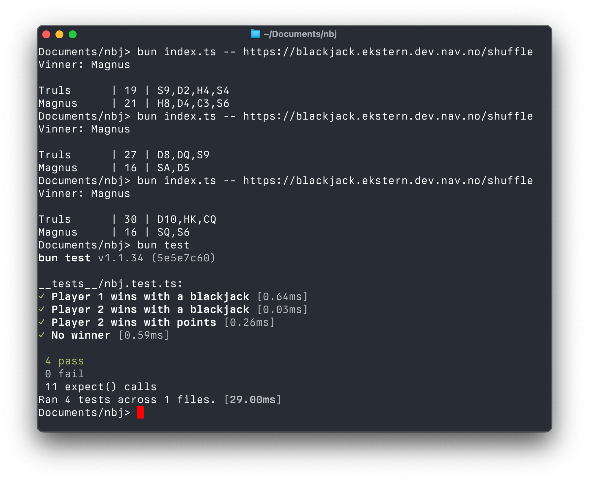

# nbj - NAV Black Jack

To install dependencies:

```bash
bun install
```

To run:

```bash
bun run index.ts -- https://blackjack.ekstern.dev.nav.no/shuffle
```

Running tests:
```bash
bun test
```



This project was created using `bun init` in bun v1.1.34. [Bun](https://bun.sh) is a fast all-in-one JavaScript runtime.

